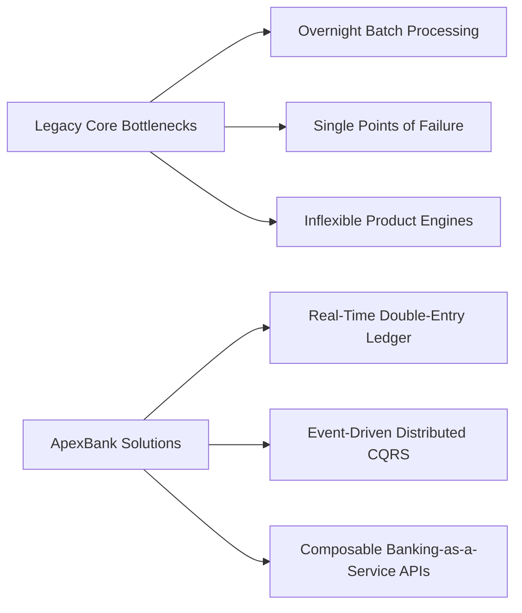
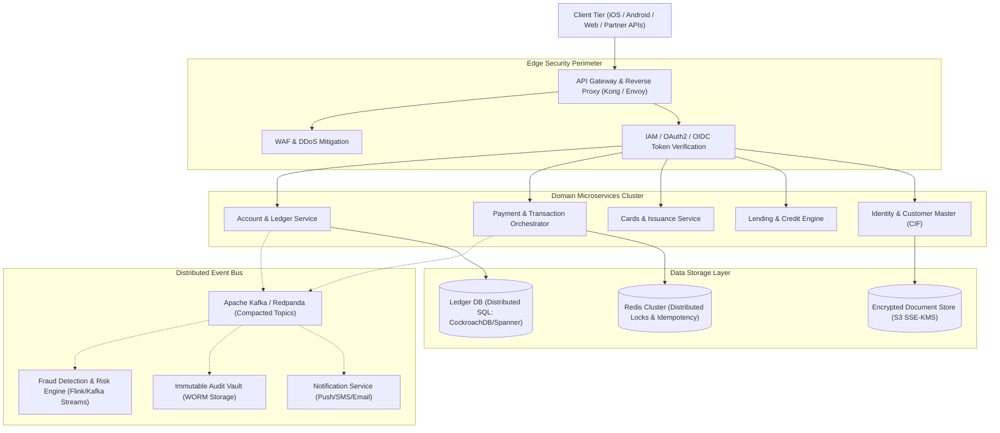
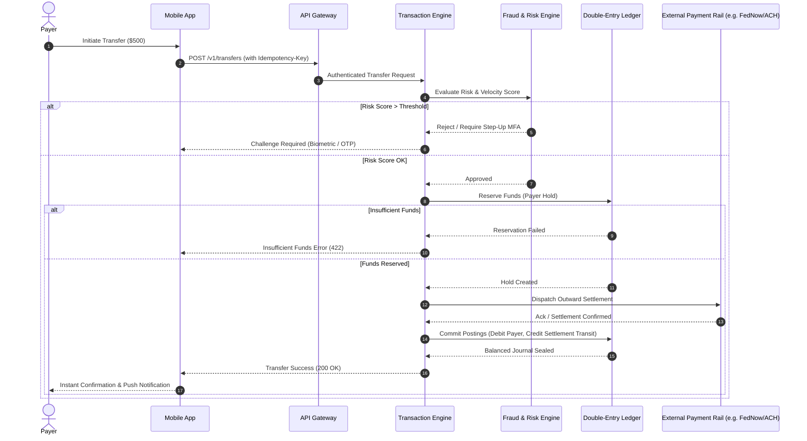
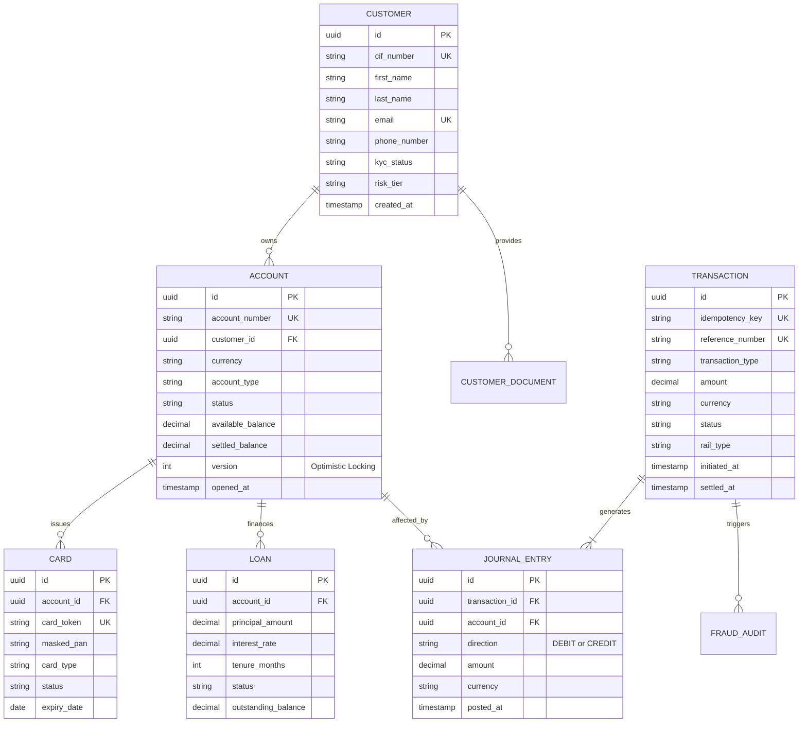
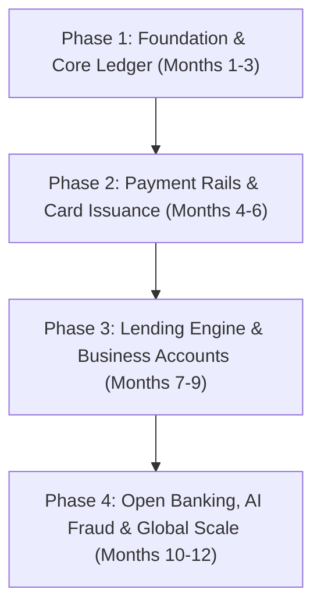

# Product Requirements Document (PRD)
## Next-Gen Enterprise Core & Digital Banking Platform (ApexBank Engine)

| Attribute | Details |
| :--- | :--- |
| **Product Name** | ApexBank Engine (Core Banking & Digital Financial Services) |
| **Document Version** | 1.0.0 |
| **Target Release** | Q1-Q4 Enterprise Roadmap |
| **Document Status** | Approved for Architecture & Engineering Review |
| **Author** | Antigravity Product & Systems Architecture Team |
| **Target Audience** | Engineering Leads, Solutions Architects, Compliance Officers, Security Teams, CPO/CTO |

---

## 1. Executive Summary & Vision

### 1.1 Executive Summary
Legacy core banking systems (COBOL-based mainframes, batch-processed reconciliation) are monolithic, fragile, expensive to maintain, and incapable of supporting real-time transaction processing at scale.

**ApexBank Engine** is a cloud-native, event-driven, microservices-based core banking platform designed for modern financial institutions, neobanks, and fintech infrastructure providers. It features an immutable double-entry ledger, sub-millisecond account lookups, distributed transaction processing with zero data loss (RPO = 0), and native support for modern payment rails (ACH, FedNow, SEPA, IMPS/UPI, SWIFT).

### 1.2 Product Vision
> *"To provide a bulletproof, real-time, audit-compliant financial foundation that enables hyper-scalable banking services with 99.999% reliability, institutional-grade security, and developer-first APIs."*

---

## 2. Market Problems & Strategic Objectives



### 2.1 Strategic Goals & KPIs
* **Zero Discrepancy Reconciliation**: 100% mathematical integrity across all ledger postings via double-entry principles.
* **Ultra-Low Latency**: P99 transaction authorization latency under **80 ms**; end-to-end payment settlement in under **2.5 seconds** on real-time rails.
* **Throughput Scalability**: Sustained load handling of **15,000+ Transactions Per Second (TPS)** with peak burst tolerance up to **50,000 TPS**.
* **High Availability**: **99.999% ("five nines")** system availability with Active-Active Multi-Region deployment (downtime < 5.26 minutes per calendar year).
* **Zero Recovery Point Objective (RPO = 0)**: Synchronous distributed journal commits ensure zero data loss during regional outages.

---

## 3. User Personas & Stakeholders

| Persona | Role | Key Responsibilities / Pain Points | Primary Jobs to Be Done (JTBD) |
| :--- | :--- | :--- | :--- |
| **Alex Rivera** *(Retail Consumer)* | End Customer (Mobile/Web) | Demands instant transfers, real-time balance alerts, zero downtime during night hours. | Transfer money, view statements, deposit checks, manage virtual cards. |
| **Morgan Chen** *(Corporate Treasurer)* | SME / Enterprise Client | Manages payroll, high-value bulk wires, dual-authorization approval workflows. | Multi-user roles, bulk payout execution, liquidity management, treasury reports. |
| **Sarah Jenkins** *(Bank Teller / Operations)* | Branch & Ops Staff | Needs quick customer lookup, cash drawer balancing, manual dispute resolution tools. | Deposit/withdrawal handling, account freeze/unfreeze, KYC override under escalation. |
| **David Vance** *(Chief Compliance Officer)* | AML / Audit Auditor | Faces regulatory scrutiny, audit trail requirements, sanctions lists matching. | Generate Suspicious Activity Reports (SAR), export cryptographically sealed audit logs. |
| **Elena Rostova** *(DevOps / Site Reliability Eng)* | Systems Architect | Manages database replication, disaster recovery, API latency spikes, patch zero-downtime. | Observability, automated failover, zero-downtime database schema migrations. |

---

## 4. System Architecture & High-Level Design

The system implements **Domain-Driven Design (DDD)** combined with **CQRS (Command Query Responsibility Segregation)** and **Event Sourcing** for transactional integrity.



---

## 5. Functional Requirements & Feature Specifications

### Module 1: Customer Information File (CIF) & Identity Engine
* **FR-1.1 Customer Onboarding**: Support self-service digital onboarding and assisted in-branch onboarding.
* **FR-1.2 KYC & Document Verification**: Integration with automated document verification providers (ID scanning, liveness detection, biometric face match).
* **FR-1.3 Watchlist & Sanction Screening**: Automated real-time checks against OFAC, PEP (Politically Exposed Persons), and domestic regulatory blocklists before account activation.
* **FR-1.4 Customer Tiering & Limits**: Configurable risk profiles (Low, Medium, High) driving dynamic transfer and withdrawal velocity limits.

### Module 2: Immutable Double-Entry Core Ledger
> [!IMPORTANT]
> The ledger is the single source of truth for all balances. Under no circumstance may an account balance be updated via an arbitrary SQL `UPDATE` statement without balancing `DEBIT` and `CREDIT` entries in the journal.

* **FR-2.1 Accounting Equation**: Guaranteed balance:
  $$\sum \text{Debits} = \sum \text{Credits}$$
* **FR-2.2 Ledger Hierarchies**: Chart of Accounts (Assets, Liabilities, Equity, Revenue, Expenses) supporting multi-currency, multi-entity, and branch-level ledger segregation.
* **FR-2.3 Account Types**:
  * Demand Deposit Accounts (Checking / Current)
  * Savings Accounts (with tier-based accrual rules)
  * Fixed Deposit / Term Deposit Accounts
  * Escrow & Transit Accounts (used during settlement clearance)
* **FR-2.4 Holds and Reservations**: Capability to place temporary holds (e.g., card pre-authorization, check holds) without mutating settled funds.

### Module 3: Payments & Transaction Orchestration


* **FR-3.1 Idempotency Guarantee**: All mutating payment endpoints must enforce an `Idempotency-Key` header with TTL of 48 hours to prevent duplicate executions from network retries.
* **FR-3.2 Distributed Transaction Coordination**: Use the **Saga Pattern** (orchestration-based) to coordinate across ledger reservations, fraud checks, and external payment rail acknowledgements.
* **FR-3.3 Payment Rails Supported**:
  * Real-Time Rails (FedNow, RTP, UPI/IMPS, SEPA Instant)
  * Traditional Clearing (ACH batch, NEFT, RTGS)
  * Cross-border messaging (SWIFT ISO 20022 MX messages)
* **FR-3.4 Bulk Payments**: Asynchronous batch payment ingestion (CSV/JSON/NACHA formats) processing up to 250,000 line items with partial failure handling.

### Module 4: Lending, Credit & Interest Calculation Engine
* **FR-4.1 Product Catalog**: Configurable loan terms (Personal Loans, Mortgages, Overdraft Facilities, Credit Lines).
* **FR-4.2 Amortization Calculation**:
  * Equated Monthly Installment (EMI) using reducing balance method.
  * Bullet repayment and interest-only grace period configurations.
* **FR-4.3 Accrual Automation**: Automated nightly End-of-Day (EOD) interest accrual engine computing:
  $$\text{Daily Accrual} = \frac{\text{Principal Outstanding} \times \text{Annual Interest Rate}}{360 \text{ or } 365}$$
* **FR-4.4 Delinquency & NPA Classification**: Automated tracking of Days Past Due (DPD) with automatic bucket transitions (Current $\to$ SMA-0 $\to$ SMA-1 $\to$ SMA-2 $\to$ NPA/Default).

### Module 5: Cards & Virtual Tokenization
* **FR-5.1 Card Lifecycle Management**: Issuance, PIN reset, freezing, blocking, and re-issuance for physical and instant virtual debit/credit cards.
* **FR-5.2 Spend Controls**: Dynamic real-time policy rules (e.g., disable international transactions, toggle ATM cash withdrawal, cap contactless payments to \$100).
* **FR-5.3 Apple Pay / Google Wallet Tokenization**: Integration with Visa Token Service (VTS) / Mastercard Digital Enablement Service (MDES).

---

## 6. Data Model & Entity Relationships

The relational model is designed for strict foreign key integrity and ACID guarantees.



---

## 7. Non-Functional Requirements (NFRs)

### 7.1 Security & Cryptography
* **Data-at-Rest Encryption**: All database volumes and backups encrypted with AES-256 using Cloud HSM / AWS KMS with automated 90-day key rotation.
* **Data-in-Transit Encryption**: Strict TLS 1.3 for all internal service-to-service communication via Mutual TLS (mTLS via Istio Service Mesh).
* **Cardholder Data Protection**: Zero plaintext storage of PANs or CVVs. Strict tokenization compliant with **PCI-DSS Level 1**.
* **Zero Trust IAM**: Fine-grained Attribute-Based Access Control (ABAC) with dual-operator verification ("four-eyes principle") required for overrides exceeding \$25,000.

### 7.2 Scalability & Performance Benchmarks
| Metric | Target SLA | Measurement Method |
| :--- | :--- | :--- |
| **Balance Read Latency** | P50 < 5 ms, P99 < 20 ms | Measured at API Gateway under 25,000 QPS |
| **Payment Posting Latency** | P50 < 40 ms, P99 < 80 ms | Time from HTTP POST to ledger write ack |
| **Core Throughput** | 15,000 TPS sustained | Distributed load test run (k6 / Locust) |
| **EOD Batch Processing** | 10 million accounts in < 45 min | Nightly parallelized worker pipeline |
| **Recovery Point Objective (RPO)** | **0 seconds** | Synchronous cross-region journal writes |
| **Recovery Time Objective (RTO)** | **< 30 seconds** | Automated multi-region active failover |

### 7.3 Regulatory Compliance & Auditability
* **Immutable Audit Trail**: All administrative and customer actions recorded in a cryptographically signed, append-only WORM (Write Once, Read Many) log stream.
* **Regulations Adhered To**:
  * **PCI-DSS 4.0** (Payment Card Security)
  * **SOC 2 Type II** (Security, Availability, Confidentiality)
  * **GDPR / CCPA** (Data Privacy & Right to be Forgotten with ledger retention carve-outs)
  * **Basel III / Dodd-Frank / RBI Core Banking Guidelines** (Capital adequacy & reserve liquidity monitoring)

---

## 8. API Design Standards & Developer Contracts

All external and internal RESTful interfaces adhere to RFC 7807 (`application/problem+json`) error specifications and require header-based idempotency.

### 8.1 Critical API Request Pattern (Funds Transfer)
```http
POST /v1/payments/transfers HTTP/1.1
Host: api.apexbank.internal
Authorization: Bearer <mTLS_Client_Token>
Content-Type: application/json
Idempotency-Key: a5f1b204-6c39-44d8-91ce-ef5499252ba3
X-Correlation-ID: req_9876543210

{
  "source_account_id": "acc_01J8G5QWERTYUIOPASDFGH",
  "destination_account_id": "acc_01J8G5ZXCVBNMASDFGHJKL",
  "amount": 1250.00,
  "currency": "USD",
  "rail": "REAL_TIME",
  "memo": "Consulting Fee Settlement",
  "metadata": {
    "invoice_id": "INV-2026-991"
  }
}
```

### 8.2 Standard Error Response Format
```json
{
  "type": "https://api.apexbank.com/errors/insufficient-available-funds",
  "title": "Insufficient Available Balance",
  "status": 422,
  "detail": "Account acc_01J8G5QWERTYUIOPASDFGH has an available balance of $420.00, which is insufficient for the requested debit of $1250.00.",
  "instance": "/v1/payments/transfers",
  "code": "ACC_INSUFFICIENT_FUNDS",
  "timestamp": "2026-09-27T05:32:00Z",
  "trace_id": "req_9876543210"
}
```

---

## 9. Phased Implementation Roadmap



### Milestone Breakdown
* **Phase 1: Foundation & Core Ledger (Months 1-3)**
  * Double-entry bookkeeping engine with CockroachDB distributed schema.
  * Account lifecycle APIs (Checking/Savings) & balance lookup.
  * Basic IAM, RBAC, and encrypted audit logging.
* **Phase 2: Payment Rails & Card Issuance (Months 4-6)**
  * Instant rail connectivity (FedNow / RTP / ACH engine integration).
  * Debit/Virtual card issuance with dynamic spend controls.
  * Real-time notification worker (SMS, Webhooks, Push).
* **Phase 3: Lending Engine & Business Accounts (Months 7-9)**
  * Loan origination, amortization schedule generator, and daily EOD interest calculation.
  * Multi-signature corporate treasury approvals and batch payroll execution.
* **Phase 4: Open Banking, AI Fraud & Global Scale (Months 10-12)**
  * Real-time streaming fraud engine with Apache Flink.
  * PSD2 / Open Banking compliant developer portal.
  * Multi-region active-active deployment and disaster recovery simulation drills.

---

## 10. Risk Management & Mitigations

| Risk Factor | Probability | Impact | Mitigation Strategy |
| :--- | :---: | :---: | :--- |
| **Distributed Split-Brain / Double Spending** | Low | Critical | Use consensus-based distributed SQL (Raft protocol); strict database row-level locking on balance reservations. |
| **Third-Party Payment Rail Outage** | Medium | High | Queue requests via Kafka with Exponential Backoff + Dead Letter Queues (DLQ); automatic failover to fallback clearing rail. |
| **Regulatory Non-Compliance Penalty** | Low | Critical | Dedicated compliance review checkpoints before every major release; immutable WORM audit logs. |
| **Data Leak / Insider Threat** | Low | Critical | Implement mandatory Four-Eyes approval for high-risk actions, strict column-level database encryption, and zero standing production credentials. |
